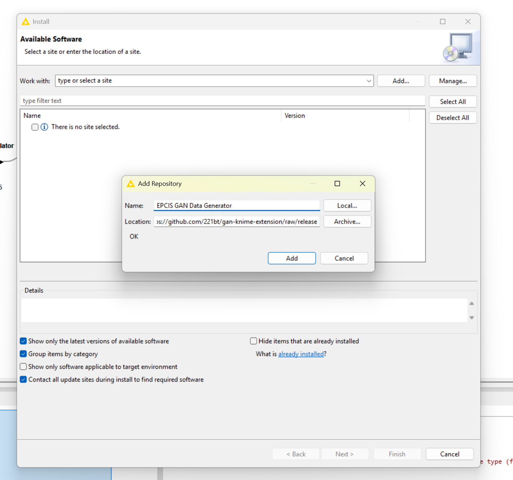
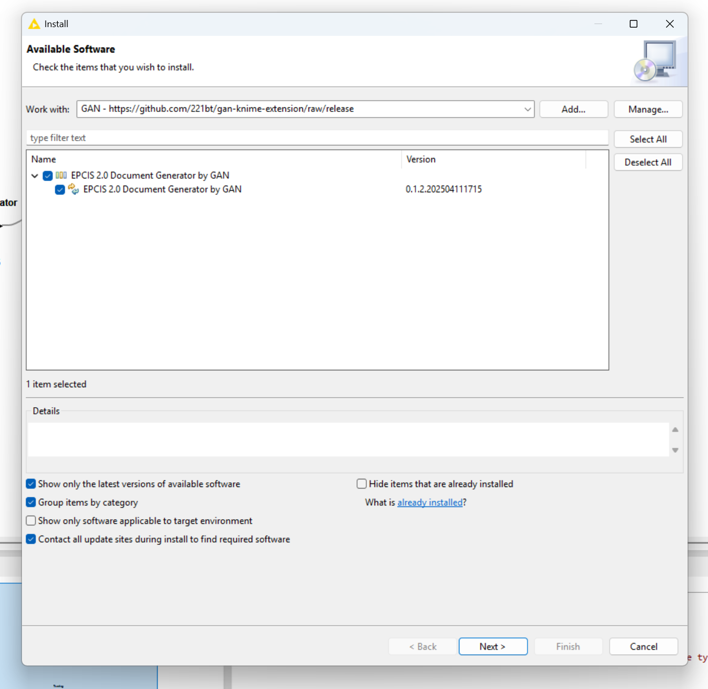
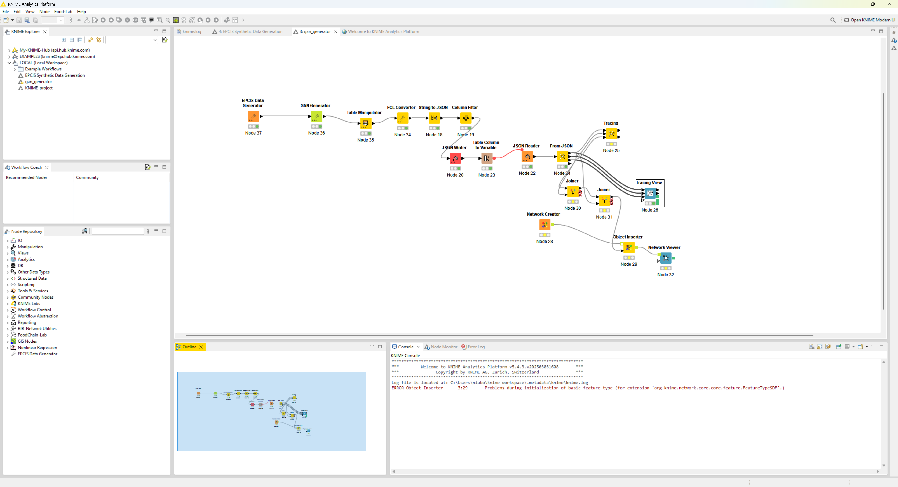

# KNIME Node: GAN-based Synthetic Data Generation for GS1 EPCIS V2 Compliance

## Overview
This KNIME node leverages Generative Adversarial Networks (GANs) to generate synthetic supply chain data that is fully compliant with the GS1 EPCIS V2 standard. GANs are a cutting-edge machine learning technique consisting of two neural networks—the generator and the discriminator—that work in opposition to produce highly realistic data. The generator creates synthetic data samples, while the discriminator evaluates them against real data, continuously improving the quality of the generated output until it closely mimics the real dataset. This approach enables the creation of diverse, high-fidelity synthetic data without compromising sensitive or proprietary information.

## Getting Started

1. Download and install/unzip the latest version of [KNIME](https://www.knime.com/downloads).
2. Select **Help > Install New Software** in the menu bar. And click **Add**, in the upper right corner.
3. In the Add Repository dialogue that appears, enter "EPCIS GAN Data Generator" for the Name and the following URL for the Location: https://github.com/221bt/gan-knime-extension/raw/release. Click **Add**.

4. In the Available Software dialogue, expand the "EPCIS 2.0 Document Generator by GAN" entry and select the checkbox next to "EPCIS 2.0 Document Generator by GAN". Click **Next**.

5. In the next window, you’ll see a list of the tools to be downloaded. Click **Finish**.
6. If a window "Trust Authorities" pops up, please tick the checkbox in the upper left corner next to "https://github.com/221bt" and click **Trust Selected**.
7. If a window pops up asking whether you trust unsigned content, please tick the checkbox in the upper left corner next to “Unsigned” and click **Trust Selected**.
8. When the installation completes, restart KNIME.
9. When the KNIME interface has shown up, you should be able to see an item "GAN Generator" in the **Node Repository** view in the bottom-left corner.And you can find them under *Community Node -> 221bt*. To run the full example workflow, please install FoodChain-Lab KNIME extension from [this site](https://foodrisklabs.bfr.bund.de/installation/) and FCL Converter from [this site](https://github.com/221bt/knime_extension)

## Benefits

1. **Data Privacy and Security**: GANs allow the generation of synthetic supply chain data that retains the statistical properties and patterns of real GS1 EPCIS V2 data while ensuring no sensitive information is exposed, making it ideal for testing, training, and sharing without privacy concerns.
2. **Enhanced Testing and Simulation**: By generating large volumes of realistic synthetic data, this node enables supply chain professionals to simulate complex scenarios, test system integrations, and validate processes under the GS1 EPCIS V2 standard without relying on limited or restricted real-world data.
3. **Accelerated Development**: Synthetic data can be produced on demand, speeding up the development and validation of supply chain solutions, analytics models, and compliance checks, reducing time-to-market and operational costs.
4. **Improved Model Training**: GAN-generated data can augment sparse or imbalanced datasets, providing a richer data environment for training machine learning models, optimizing supply chain visibility, traceability, and decision-making.
5. **Compliance Assurance**: The node ensures that all synthetic data adheres to the GS1 EPCIS V2 standard, maintaining consistency in event data, business steps, and disposition codes, thus supporting interoperability and standardization across global supply chains.

## Suitable Use Cases
The EPCIS-based synthetic supply chain data generated by this node can be leveraged in a variety of scenarios, making it an invaluable resource for researchers, analysts, and industry professionals. Here are some key applications:

- **Training Machine Learning Models for Traceability and Recall**: Use the synthetic data to train AI models that can quickly trace Food - - **Safety**: In the food supply chain, this node can generate synthetic GS1 EPCIS V2 data to simulate traceability events, such as temperature excursions during transport, contamination risks, or recalls. For instance, food safety regulators and manufacturers can use synthetic data to test response strategies for a hypothetical E. coli outbreak, tracing affected batches through the supply chain without using real sensitive data. This enables better preparation for audits, risk assessment, and consumer safety protocols while ensuring compliance with global food safety standards.
- **Drug Supply Chain**: For pharmaceutical companies and healthcare providers, the node can create synthetic data to model drug distribution, track counterfeit medications, or simulate supply disruptions (e.g., during a pandemic). For example, synthetic data can be used to train systems to detect diversion of controlled substances or ensure the integrity of the cold chain for vaccines, all while adhering to GS1 EPCIS V2 requirements. This supports regulatory compliance, improves supply chain resilience, and enhances patient safety without risking exposure of actual drug shipment details.

This node empowers users to harness the power of GAN technology to create compliant, secure, and actionable synthetic data, revolutionizing supply chain analytics and innovation in critical sectors like food safety and pharmaceuticals while adhering to industry standards.

## Acknowledgments
We are grateful for the support and expertise provided by [Equinoxys](https://equinoxys.com/), a KNIME Award-winning partner. Their guidance and collaboration were instrumental in transforming our data-generating function into a KNIME node, ensuring it meets the needs of the AI/ML and supply chain communities. Equinoxys’ commitment to innovation and excellence in data science solutions has been a valuable asset to this project.

